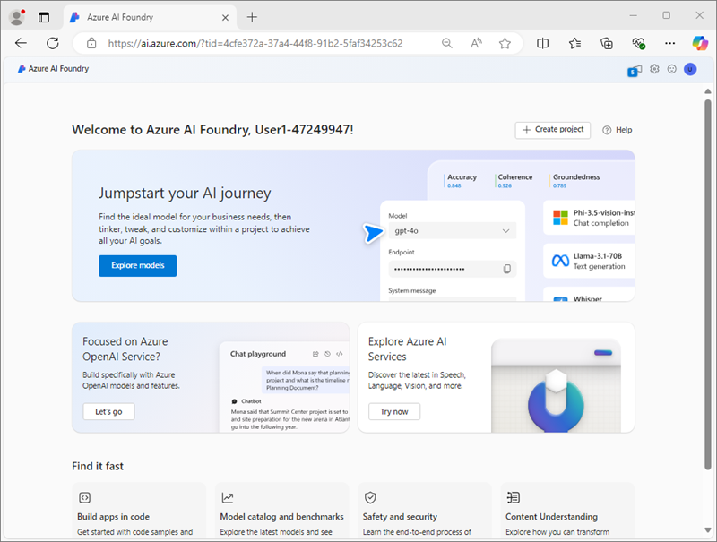

---
lab:
  title: Azure AI 콘텐츠 이해를 사용하여 콘텐츠 분석
  module: Multimodal analysis with Content Understanding
---

# Azure AI 콘텐츠 이해를 사용하여 콘텐츠 분석

이 연습에서는 Azure AI 파운드리 포털을 사용하여 송장에서 정보를 추출할 수 있는 콘텐츠 이해 프로젝트를 만듭니다. 그런 다음, Azure AI 파운드리 포털에서 콘텐츠 분석기를 테스트하고 콘텐츠 이해 REST 인터페이스를 통해 이용합니다.

이 연습에는 약 **30**분이 소요됩니다.

## Azure AI 파운드리 프로젝트 만들기

먼저 Azure AI 파운드리 프로젝트를 만들어 보겠습니다.

1. 웹 브라우저에서 [Azure AI 파운드리 포털](https://ai.azure.com)(`https://ai.azure.com`)을 열고 Azure 자격 증명을 사용하여 로그인합니다. 처음 로그인할 때 열리는 팁이나 빠른 시작 창을 닫고 필요한 경우 왼쪽 위에 있는 **Azure AI 파운드리** 로고를 사용하여 다음 이미지와 유사한 홈 페이지로 이동합니다.

    

1. 홈페이지에서 **+ 프로젝트 만들기**를 선택합니다.
1. **프로젝트 만들기** 마법사에서 유효한 프로젝트 이름을 입력하고 기존 허브가 추천되면 새 허브를 만드는 옵션을 선택합니다. 그런 다음 허브 및 프로젝트를 지원하기 위해 자동으로 만들어지는 Azure 리소스를 검토합니다.
1. **사용자 지정**을 선택하고 허브에 대해 다음 설정을 지정합니다.
    - **허브 이름**: *허브에서 유효한 이름*
    - **구독**: ‘Azure 구독’
    - **리소스 그룹**: ‘리소스 그룹 만들기 또는 선택’
    - **위치**: 다음 지역 중 하나를 선택합니다\*
        - 미국 서부
        - 스웨덴 중부
        - 오스트레일리아 동부
    - **Azure AI 서비스 또는 Azure OpenAI 연결**: *새 AI 서비스 리소스 만들기*
    - **Azure AI 검색 연결**: *고유한 이름을 가진 새 Azure AI 검색 리소스 만들기*

    > \*작성 시점에 Azure AI 콘텐츠 이해는 이러한 지역에서만 사용할 수 있습니다.

1. **다음**을 선택하여 구성을 검토합니다. **만들기**를 선택하고 프로세스가 완료될 때까지 기다립니다.
1. 프로젝트를 만들 때 표시되는 팁을 모두 닫고 Azure AI 파운드리 포털에서 프로젝트 페이지를 검토합니다. 이 페이지는 다음 이미지와 유사합니다.

    

## 콘텐츠 이해 분석기 만들기

송장에서 정보를 추출할 수 있는 분석기를 만들려고 합니다. 먼저 송장 양식에 따라 스키마를 정의합니다.

1. 새 브라우저 탭의 `https://github.com/microsoftlearning/mslearn-ai-document-intelligence/raw/main/Labfiles/05-content-understanding/forms/invoice-1234.pdf`에서 [invoice-1234.pdf](https://github.com/microsoftlearning/mslearn-ai-document-intelligence/raw/main/Labfiles/05-content-understanding/forms/invoice-1234.pdf) 샘플 양식을 다운로드하여 로컬 폴더에 저장합니다.
1. Azure AI 파운드리 프로젝트의 홈페이지가 포함된 탭으로 돌아가 왼쪽 탐색 창에서 **콘텐츠 이해**를 선택합니다.
1. **콘텐츠 이해** 페이지에서 상단의 **사용자 지정 분석기** 탭을 선택합니다.
1. 콘텐츠 이해 사용자 지정 분석기 페이지에서 **+ 만들기**를 선택하고 다음 설정으로 작업을 만듭니다.
    - **작업 이름**: 송장 분석
    - **설명**: 송장에서 데이터 추출
    - **Azure AI 서비스 연결**: *Azure AI 파운드리 허브의 Azure AI 서비스 리소스*
    - **Azure Blob Storage 계정**: *Azure AI 파운드리 허브의 기본 스토리지 계정*
1. 작업이 만들어지는 동안 기다립니다.

    > **팁**: 스토리지에 액세스하는 동안 오류가 발생하면 잠시 기다렸다가 다시 시도합니다.

1. **스키마 정의** 페이지에서 방금 다운로드한 **invoice-1234.pdf** 파일을 업로드합니다.
1. **송장 분석** 템플릿을 선택한 다음 **만들기**를 선택합니다.

    *송장 분석* 템플릿에는 송장에서 흔히 볼 수 있는 필드가 포함되어 있습니다. 스키마 편집기를 사용하여 필요하지 않은 제안된 필드를 삭제하고 필요한 사용자 지정 필드를 추가할 수 있습니다.

1. 제안된 필드 목록에서 **BillingAddress**를 선택합니다. 이 필드는 업로드한 송장 형식에 필요하지 않으므로 표시되는 **필드 삭제**(**&#128465;**) 아이콘을 사용하여 삭제할 수 있습니다.
1. 이제 필요하지 않은 다음 제안된 필드를 삭제합니다.
    - BillingAddressRecipient
    - CustomerAddressRecipient
    - 고객 ID
    - CustomerTaxId
    - DueDate
    - InvoiceTotal
    - PaymentTerm
    - PreviousUnpaidBalance
    - PurchaseOrder
    - RemittanceAddress
    - RemittanceAddressRecipient
    - ServiceAddress
    - ServiceAddressRecipient
    - ShippingAddress
    - ShippingAddressRecipient
    - TotalDiscount
    - VendorAddressRecipient
    - VendorTaxId
    - TaxDetails
1. **+ 새 필드 추가** 버튼을 사용하여 다음 필드를 추가합니다.

    | 필드 이름 | 필드 설명 | 값 유형 | 메서드 |
    |--|--|--|--|
    | `VendorPhone` | `Vendor telephone number` | 문자열 | 추출 |
    | `ShippingFee` | `Fee for shipping` | number | 추출 |

1. 완료된 스키마가 다음과 같은지 확인한 다음 **저장**을 선택합니다.
    

1. **테스트 분석기** 페이지에서 분석이 자동으로 시작되지 않으면 **분석 실행**을 선택합니다. 그런 다음 분석이 완료될 때까지 기다렸다가 스키마의 필드와 일치하는 것으로 식별되는 송장의 텍스트 값을 검토합니다.
1. 분석 결과를 검토하면 다음과 비슷하게 보일 것입니다.

    

1. **필드** 창에서 식별된 필드의 세부 정보를 확인한 다음 **결과** 탭을 보고 JSON 형식을 확인합니다.

## 분석기 빌드 및 테스트

이제 송장에서 필드를 추출하는 모델을 학습시켰으므로 유사한 양식에 사용할 분석기를 빌드할 수 있습니다.

1. **분석기 빌드** 페이지를 선택한 다음 **+ 분석기 빌드**를 선택하고 다음 속성을 사용하여 새 분석기를 빌드합니다(여기에 표시된 대로 정확하게 입력).
    - **이름**: `contoso-invoice-analyzer`
    - **설명**: `Contoso invoice analyzer`
1. 새 분석기가 준비될 때까지 기다립니다(**새로 고침** 단추를 사용하여 확인).
1. `https://github.com/microsoftlearning/mslearn-ai-document-intelligence/raw/main/Labfiles/05-content-understanding/forms/invoice-1235.pdf`에서 [invoice-1235.pdf](https://github.com/microsoftlearning/mslearn-ai-document-intelligence/raw/main/Labfiles/05-content-understanding/forms/invoice-1235.pdf)를 다운로드하여 로컬 폴더에 저장합니다.
1. **분석기 빌드** 페이지로 돌아가서 **contoso-invoice-analyzer** 링크를 선택합니다. 분석기 스키마에 정의된 필드가 표시됩니다.
1. **contoso-invoice-analyzer** 페이지에서 **테스트** 탭을 선택합니다.
1. **+ 테스트 파일 업로드** 버튼을 사용하여 **invoice-1235.pdf** 파일을 업로드하고 분석을 실행하여 테스트 양식에서 필드 데이터를 추출합니다.
1. 테스트 결과를 검토하고 분석기가 테스트 송장에서 올바른 필드를 추출했는지 확인합니다.
1. **contoso-invoice-analyzer*** 페이지를 닫습니다.

## 콘텐츠 이해 REST API 사용

이제 분석기를 만들었으므로 콘텐츠 이해 REST API를 통해 클라이언트 응용 프로그램에서 사용할 수 있습니다.

1. **프로젝트 세부 정보** 영역에서 **프로젝트 연결 문자열**을 확인합니다. 이 연결 문자열 사용하여 클라이언트 응용 프로그램에서 프로젝트에 연결합니다.
1. 새 브라우저 탭을 엽니다(Azure AI 파운드리 포털을 기존 탭에서 열어 두기). 그런 다음 새 탭에서 [Azure Portal](https://portal.azure.com)(`https://portal.azure.com`)을 열고 메시지가 나타나면 Azure 자격 증명을 사용하여 로그인합니다.

    Azure Portal 홈페이지를 보려면 환영 알림을 닫습니다.

1. 페이지 상단의 검색 창 오른쪽에 있는 **[\>_]** 단추를 사용하여 Azure Portal에서 새 Cloud Shell을 만들고 구독에 저장소가 없는 ***PowerShell*** 환경을 선택합니다.

    Cloud Shell은 Azure Portal 하단의 창에서 명령줄 인터페이스를 제공합니다. 보다 쉽게 작업할 수 있도록 이 창의 크기를 조정하거나 최대화할 수 있습니다.

    > **참고**: 이전에 *Bash* 환경을 사용하는 Cloud Shell을 만든 경우 ***PowerShell***로 전환합니다.

1. Cloud Shell 도구 모음의 **설정** 메뉴에서 **클래식 버전으로 이동**을 선택합니다(코드 편집기를 사용하는 데 필요).

    **<font color="red">계속하기 전에 Cloud Shell의 클래식 버전으로 전환했는지 확인합니다.</font>**

1. Cloud Shell 창에서 다음 명령을 입력하여 이 연습의 코드 파일이 포함된 GitHub 리포지토리를 복제합니다(명령을 입력하거나 클립보드에 복사한 다음 명령줄을 마우스 오른쪽 단추로 클릭하고 일반 텍스트로 붙여넣기).

    ```
   rm -r mslearn-ai-foundry -f
   git clone https://github.com/microsoftlearning/mslearn-ai-document-intelligence mslearn-ai-doc
    ```

    > **팁**: CloudShell에 명령을 입력하면 출력이 화면 버퍼의 많은 부분을 차지할 수 있습니다. `cls` 명령을 입력해 화면을 지우면 각 작업에 더 집중할 수 있습니다.

1. 리포지토리가 복제된 후 앱의 코드 파일이 들어 있는 폴더로 이동합니다.

    ```
   cd mslearn-ai-doc/Labfiles/05-content-understanding/code
   ls -a -l
    ```

1. Cloud Shell 명령줄 창에서 다음 명령을 입력하여 사용할 라이브러리를 설치합니다.

    ```
   python -m venv labenv
   ./labenv/bin/Activate.ps1
   pip install dotenv azure-identity azure-ai-projects
    ```

1. 제공된 구성 파일을 편집하려면 다음 명령을 입력합니다.

    ```
   code .env
    ```

    코드 편집기에서 파일이 열립니다.

1. 코드 파일에서 **YOUR_PROJECT_CONNECTION_STRING** 자리 표시자를 프로젝트의 연결 문자열(Azure AI 파운드리 포털의 프로젝트 **개요** 페이지에서 복사)로 바꾸고 **ANALYZER**가 분석기에 할당된 이름으로 설정되었는지 확인합니다(*contoso-invoice-analyzer*여야 함).
1. 자리 표시자를 바꾼 후 코드 편집기에서 **CTRL+S** 명령을 사용하여 변경 내용을 저장한 다음 **CTRL+Q** 명령을 사용하여 Cloud Shell 명령줄을 열어둔 채 코드 편집기를 닫습니다.

1. Cloud Shell 명령줄에서 다음 명령을 입력하여 제공된 **analyze_invoice.py** Python 코드 파일을 편집합니다.

    ```
    code analyze_invoice.py
    ```
    Python 코드 파일은 코드 편집기에서 열립니다.

1. 다음 코드를 검토합니다.
    - 분석할 송장 파일을 식별하며, 기본값은 **invoice-1236.pdf**입니다.
    - 프로젝트에서 Azure AI 서비스 리소스의 엔드포인트 및 키를 검색합니다.
    - 콘텐츠 이해 엔드포인트에 HTTP POST 요청을 제출하여 이미지를 분석하도록 지시합니다.
    - POST 작업의 응답을 확인하여 분석 작업의 ID를 검색합니다.
    - 작업이 더 이상 실행되지 않을 때까지 콘텐츠 이해 서비스에 HTTP GET 요청을 반복적으로 제출합니다.
    - 작업이 성공하면 JSON 응답을 구문 분석하고 검색된 값을 표시합니다.
1. **Ctrl +Q** 명령을 사용하여 Cloud Shell 명령줄을 열어 두고 코드 편집기를 닫습니다.
1. Cloud Shell 명령줄 창에서 다음 명령을 입력하여 Python 코드를 실행합니다.

    ```
    python analyze_invoice.py invoice-1236.pdf
    ```

1. 프로그램의 출력을 검토합니다.
1. 다음 명령을 사용하여 다른 송장으로 프로그램을 실행합니다.

    ```
    python analyze_invoice.py invoice-1235.pdf
    ```

    > **팁**: 코드 폴더에 사용할 수 있는 세 개의 송장 파일(invoice-1234.pdf, invoice-1235.pdf 및 invoice-1236.pdf)이 있습니다. 

## 정리

콘텐츠 이해 서비스에서 작업을 완료한 경우 불필요한 Azure 비용이 발생하지 않도록 이 연습에서 만든 리소스를 삭제해야 합니다.

1. Azure AI 파운드리 포털에서 **여행 보험** 프로젝트로 이동하여 삭제합니다.
1. Azure Portal에서 이 연습용으로 만든 리소스 그룹을 삭제합니다.

