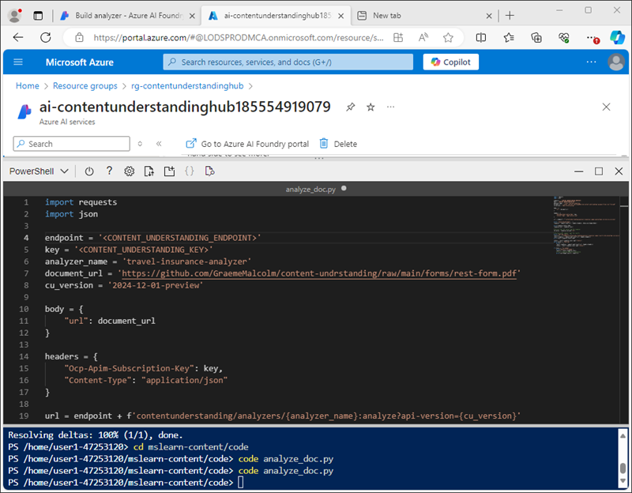

---
lab:
  title: Azure AI 콘텐츠 이해를 사용하여 콘텐츠 분석
  module: Multimodal analysis with Content Understanding
---

# Azure AI 콘텐츠 이해를 사용하여 콘텐츠 분석

이 연습에서는 Azure AI 파운드리 포털을 사용하여 여행 보험 정책 양식에서 정보를 추출할 수 있는 콘텐트 이해 프로젝트를 만듭니다. 그런 다음, Azure AI 파운드리 포털에서 콘텐츠 분석기를 테스트하고 콘텐츠 이해 REST 인터페이스를 통해 이용합니다.

이 연습에는 약 **30**분이 소요됩니다.

## 콘텐츠 이해 프로젝트 만들기

먼저 Azure AI 파운드리 포털을 사용하여 콘텐츠 이해 프로젝트를 만들어 보겠습니다.

1. 웹 브라우저에서 [Azure AI 파운드리 포털](https://ai.azure.com)(`https://ai.azure.com`)을 열고 Azure 자격 증명을 사용하여 로그인합니다.

    Azure AI Foundry 포털의 홈페이지는 다음 이미지와 유사합니다.

    

1. 홈페이지의 **빠른 찾기** 섹션에서 아래에 있는 **콘텐츠 이해**를 선택합니다.
1. **콘텐츠 이해** 페이지에서 **새 콘텐츠 이해 프로젝트 만들기** 단추를 선택합니다.
1. **프로젝트 개요** 단계에서 프로젝트에 대해 다음 속성을 설정한 후, **다음**을 선택합니다.
    - **프로젝트 이름**: `travel-insurance`
    - **설명**: `Insurance policy data extraction`
    - **허브**: 새 허브 만들기
1. **허브 만들기** 단계에서 다음 속성을 설정한 후, **다음**을 선택합니다.
    - **Azure AI 허브 리소스**: `content-understanding-hub`
    - **Azure 구독**: *Azure 구독 선택*
    - **리소스 그룹**: *적절한 이름의 새 리소스 그룹 만들기*
    - **위치**: *사용 가능한 지역 선택*
    - **Azure AI 서비스**: *적절한 이름으로 새 Azure AI 서비스 리소스 만들기*
1. **스토리지 설정** 단계에서 새 AI Hub 스토리지 계정을 지정하고 **다음**을 선택합니다.
1. **검토** 페이지에서 **프로젝트 만들기**를 선택합니다. 그런 다음 프로젝트 및 관련 리소스가 만들어질 때까지 기다립니다.

    프로젝트가 준비되면 **스키마 정의** 페이지에서 열립니다.

    

## Azure 리소스 검토

AI 허브 및 프로젝트를 만들 때 프로젝트를 지원하기 위해 Azure 구독에 다양한 리소스가 생성되었습니다.

1. 새 브라우저 탭에서 [Azure Portal](https://portal.azure.com)(`https://portal.azure.com`)을 열고 Azure 자격 증명을 사용하여 로그인합니다.
1. 허브를 만든 리소스 그룹으로 이동하여 생성된 Azure 리소스를 확인합니다.

    

## 사용자 지정 스키마 정의

여행 보험 양식에서 정보를 추출할 수 있는 분석기를 빌드하려고 합니다. 먼저 샘플 양식에 따라 스키마를 정의합니다.

1. [train-form.pdf](https://github.com/microsoftlearning/mslearn-ai-document-intelligence/raw/main/Labfiles/05-content-understanding/forms/train-form.pdf) 샘플 양식`https://github.com/microsoftlearning/mslearn-ai-document-intelligence/raw/main/Labfiles/05-content-understanding/forms/train-form.pdf`을 다운로드하여 로컬 폴더에 저장합니다.
1. 콘텐츠 이해 프로젝트가 포함된 브라우저 탭으로 돌아가서 **스키마 정의** 페이지에서 방금 다운로드한 **train-form.pdf** 파일을 업로드합니다.
1. **문서 분석** 템플릿을 선택한 다음 **만들기**를 선택합니다.

    스키마 편집기는 오른쪽에 표시된 양식에서 추출할 데이터 필드를 정의하는 방법을 제공합니다. 양식은 다음과 유사합니다.

    

    양식의 데이터 필드는 다음으로 구성됩니다.
    
    - 정책 소유자와 관련된 개인 정보의 컬렉션입니다.
    - 보험이 필요한 여행과 관련된 세부 정보의 컬렉션입니다.
    - 서명 및 날짜

    먼저 개인 정보를 나타내는 필드를 테이블로 추가하여 개별 세부 정보에 대한 하위 필드를 정의합니다.

1. **+새 필드 추가**를 선택하여 다음 값으로 새 필드를 만듭니다.
    - **필드 이름**: `PersonalDetails`
    - **필드 설명**: `Policyholder information`
    - **값 형식**: 테이블
1. **변경 내용 저장**(&#10004;)을 선택하고 자동으로 만들어진 새 하위 필드를 확인합니다.
1. 새 하위 필드를 다음 값으로 구성합니다.
    - **필드 이름**: `PolicyholderName`
    - **필드 설명**: `Policyholder name`
    - **값 형식**: 문자열
    - **메서드**: 추출
1. **+ 새 하위 필드 추가** 단추를 사용하여 다음 하위 필드를 추가합니다.

    | 필드 이름 | 필드 설명 | 값 유형 | 메서드 |
    |--|--|--|--|
    | `StreetAddress` | `Policyholder address` | 문자열 | 추출 |
    | `City` | `Policyholder city` | 문자열 | 추출 |
    | `PostalCode` | `Policyholder post code` | 문자열 | 추출 |
    | `CountryRegion` | `Policyholder country or region` | 문자열 | 추출 |
    | `DateOfBirth` | `Policyholder birth date` | 날짜 | 추출 |

1. 모든 개인 정보 하위 필드를 추가한 후 **뒤로** 단추를 사용하여 스키마의 최상위 수준으로 돌아갑니다.
1. 피보험자 여행의 세부 정보를 나타내는 **`TripDetails`** 이라는 새 *테이블* 필드를 추가합니다. 그리고 다음 하위 필드를 추가합니다.

    | 필드 이름 | 필드 설명 | 값 유형 | 메서드 |
    |--|--|--|--|
    | `DestinationCity` | `Trip city` | 문자열 | 추출 |
    | `DestinationCountry` | `Trip country or region` | 문자열 | 추출 |
    | `DepartureDate` | `Date of departure` | 날짜 | 추출 |
    | `ReturnDate` | `Date of return` | 날짜 | 추출 |

1. 스키마의 최상위 수준으로 돌아가서 다음 두 개의 개별 필드를 추가합니다.

    | 필드 이름 | 필드 설명 | 값 유형 | 메서드 |
    |--|--|--|--|
    | `Signature` | `Policyholder signature` | 문자열 | 추출 |
    | `Date` | `Date of signature` | 날짜 | 추출 |

1. 완료된 스키마가 다음과 같은지 확인한 다음 저장합니다.

    

1. **테스트 분석기** 페이지에서 분석이 자동으로 시작되지 않으면 **분석 실행**을 선택합니다. 그런 다음 분석이 완료될 때까지 기다렸다가 스키마의 필드와 일치하는 것으로 식별되는 양식의 텍스트 값을 검토합니다.

    

    콘텐츠 이해 서비스는 스키마의 필드에 해당하는 텍스트를 올바르게 식별해야 합니다. 그렇지 않은 경우 **레이블 데이터** 페이지를 사용하여 다른 샘플 양식을 업로드하고 각 필드에 대한 올바른 텍스트를 명시적으로 식별할 수 있습니다.

## 분석기 빌드 및 테스트

이제 보험 양식에서 필드를 추출하는 모델을 학습했으므로 유사한 양식에 사용할 분석기를 빌드할 수 있습니다.

1. 왼쪽 탐색 창에서 **분석기 빌드** 페이지를 선택합니다.
1. **+ 빌드 분석기**를 선택하고 다음 속성(여기에 표시된 대로 정확하게 입력됨)을 사용하여 새 분석기를 빌드합니다.
    - **이름**: `travel-insurance-analyzer`
    - **설명**: `Insurance form analyzer`
1. 새 분석기가 준비될 때까지 기다립니다(**새로 고침** 단추를 사용하여 확인).
1. [test-form.pdf](https://github.com/microsoftlearning/mslearn-ai-document-intelligence/raw/main/Labfiles/05-content-understanding/forms/test-form.pdf) 양식`https://github.com/microsoftlearning/mslearn-ai-document-intelligence/raw/main/Labfiles/05-content-understanding/forms/test-form.pdf`을 다운로드하여 로컬 폴더에 저장합니다.
1. **분석기 빌드** 페이지로 돌아가서 **여행 보험 분석기** 링크를 선택합니다. 분석기 스키마에 정의된 필드가 표시됩니다.
1. **여행 보험 분석기** 페이지에서 **테스트**를 선택합니다.
1. **+ 테스트 파일 업로드** 단추를 사용하여 **test-form.pdf**를 업로드하고 분석을 실행하여 테스트 양식에서 필드 데이터를 추출합니다.

    

1. 분석기에서 반환된 JSON 형식 결과를 보려면 **결과** 탭을 봅니다. 다음 작업에서는 콘텐츠 이해 REST API를 사용하여 양식을 분석기로 제출하고 결과를 이 형식으로 반환합니다.
1. **여행 보험 분석기** 페이지를 닫습니다.

## 콘텐츠 이해 REST API 사용

이제 분석기를 만들었으므로 콘텐츠 이해 REST API를 통해 클라이언트 응용 프로그램에서 사용할 수 있습니다.

1. Azure Portal이 포함된 브라우저 탭으로 전환하거나 닫은 경우 새 탭에서 `https://portal.azure.com`을(를) 엽니다.
1. 콘텐츠 이해 허브에 대한 리소스 그룹에서 **Azure AI 서비스** 리소스를 엽니다.
1. **개요** 페이지의 **키 및 엔드포인트** 섹션에서 **콘텐츠 이해** 탭을 봅니다.

    

    클라이언트 응용 프로그램에서 분석기로 연결하려면 콘텐츠 이해 엔드포인트와 키 중 하나가 필요합니다.

1. 페이지 상단의 검색 창 오른쪽에 있는 **[\>_]** 단추를 사용하여 Azure Portal에서 새 Cloud Shell을 만들고 ***PowerShell*** 환경을 선택합니다. Cloud Shell은 다음과 같이 Azure Portal 아래쪽 창에 명령줄 인터페이스를 제공합니다.

    

    > **참고**: 이전에 *Bash* 환경을 사용하는 Cloud Shell을 만든 경우 ***PowerShell***로 전환합니다.

1. 창 상단의 구분줄을 끌거나 창 오른쪽 위에 있는 **&#8212;** , **&#10530;** 및 **X** 아이콘을 사용하여 Cloud Shell 크기를 조정하여 창을 최소화, 최대화하고 닫을 수 있습니다. Azure Cloud Shell 사용에 관한 자세한 내용은 [Azure Cloud Shell 설명서](https://docs.microsoft.com/azure/cloud-shell/overview)를 참조하세요.
1. Cloud Shell 도구 모음의 **설정** 메뉴에서 **클래식 버전으로 이동**을 선택합니다(코드 편집기를 사용하는 데 필요).

1. PowerShell 창에서 다음 명령을 입력하여 이 연습이 포함된 GitHub 리포지토리를 복제합니다.

    ```
    rm -r mslearn-ai-doc -f
    git clone https://github.com/microsoftlearning/mslearn-ai-document-intelligence mslearn-ai-doc
    ```

1. 리포지토리가 복제된 후 **mslearn-ai-doc/Labfiles/05-content-understanding/code** 폴더로 이동합니다.

    ```
    cd mslearn-ai-doc/Labfiles/05-content-understanding/code
    ```

1. 다음 명령을 입력하여 제공된 **analyze_doc.py** Python 코드 파일을 편집합니다.

    ```
    code analyze_doc.py
    ```
    Python 코드 파일은 코드 편집기에서 열립니다.

    

1. 코드 파일에서 **\<CONTENT_UNDERSTANDING_ENDPOINT\>** 자리 표시자를 콘텐츠 이해 엔드포인트로 바꾸고 **\<CONTENT_UNDERSTANDING_KEY\>** 자리 표시자를 Azure AI 서비스 리소스의 키 중 하나로 바꿉니다.

    > **팁**: Azure Portal의 Azure AI 서비스 리소스 페이지에서 엔드포인트와 키를 복사하려면 Cloud Shell 창의 크기를 조정하거나 최소화해야 합니다. Cloud Shell을 *닫지* 않도록 주의해야 합니다(그렇지 않으면 위의 단계를 반복해야 합니다).

1. 자리 표시자를 바꾼 후 **Ctrl+S** 명령을 사용하여 변경 내용을 저장한 다음 완료된 코드를 검토합니다.
    - 콘텐츠 이해 엔드포인트에 HTTP POST 요청을 제출하여 **여행 보험 분석기** 에서 URL을 기반으로 양식을 분석하도록 지시합니다.
    - POST 작업의 응답을 확인하여 분석 작업의 ID를 검색합니다.
    - 작업이 더 이상 실행되지 않을 때까지 콘텐츠 이해 서비스에 HTTP GET 요청을 반복적으로 제출합니다.
    - 작업이 성공하면 JSON 응답이 표시됩니다.
1. **Ctrl +Q** 명령을 사용하여 Cloud Shell 명령줄을 열어 두고 코드 편집기를 닫습니다.
1. Cloud Shell 명령줄 창에서 다음 명령을 입력하여 코드에서 사용되는 Python **요청** 라이브러리를 설치합니다.

    ```
    pip install requests
    ```

1. 라이브러리가 설치되면 Cloud Shell 명령줄 창에서 다음 명령을 입력하여 Python 코드를 실행합니다.

    ```
    python analyze_doc.py
    ```

1. 문서 분석의 JSON 결과를 포함하는 프로그램의 출력을 검토합니다.

    > **팁**: Cloud Shell 콘솔의 화면 버퍼가 전체 출력을 표시할 만큼 크지 않을 수 있습니다. 전체 출력을 검토하려면 명령 `python analyze_doc.py > output.txt`을(를)사용하여 프로그램을 실행합니다. 그런 다음 프로그램이 완료되면 명령 `code output.txt`을(를) 사용하여 코드 편집기에서 출력을 엽니다.

## 정리

콘텐츠 이해 서비스에서 작업을 완료한 경우 불필요한 Azure 비용이 발생하지 않도록 이 연습에서 만든 리소스를 삭제해야 합니다.

1. Azure AI 파운드리 포털에서 **여행 보험** 프로젝트로 이동하여 삭제합니다.
1. Azure Portal에서 이 연습용으로 만든 리소스 그룹을 삭제합니다.

